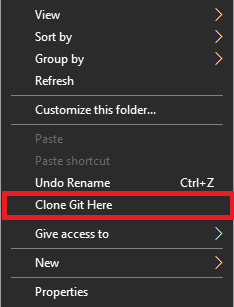

# Context Menu Shortcut for Cloning a Git Repo
## Setup
* 1 Import the reg file.
* 2 When you click "Clone Git Here" in the context menu git will clone the repo to the current folder.
## Screenshot
